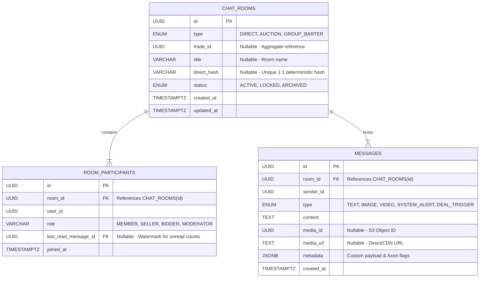

Gemini
New chat
Search chats
Images
Videos
Library
New notebook
Untitled notebook
BarterGrid Chat Service Design
UFileT2 and Ontario T2 Filing
Kustomize EtcdCluster Resource Limits
ArgoCD Application Update Conflict
Rancher CPU Capacity and Deployment
Gradle Deprecation Warnings Resolution
GSC Duplicate URL: Tracking Parameters Explained
Hedera Service Requirements for BarterGrid
Kube-apiserver Etcd Connection Failure
Fixing Duplicate Content in Search Console
Why BPMN Isn't More Widely Used
High OpenObserve Collector Memory Usage
RKE2 Node Disk Full: Image Cleanup
Barter Site Sign-Up Drop-Off Analysis
Improving AI Video Generation Prompts
Responsive Navigation for BarterGrid
Prompting Phone Screen Toward Camera
Home Mini-Data Center for Production
KVM I/O Error: Drive and Filesystem
North American Ad Demographics: US vs. Canada
Aligning Narrative with Video Prompt
American vs. British Male Voice Reception
AI Prompts for Energy Concepts
Extending Veo 3 Animation Prompts
Linux Video/Audio Editing Tools
Prompt Tweak: Geometric Overlay Placement
Prompt Enhancement for Business Professionals
Conversation with Gemini

I want to work out purpose and requirements for a Chat Service microservice which is part of bartergrid. It's features real time chat with firebase (or equivalent supabase or another alternative or postgres), potential multi-chat for auction rooms or multi-chat. And also integrate with axon-server when certain phrases are mentioned e.g. "It is a deal!" Which emits an axon event?

Here is a breakdown of the Core Purpose, Architectural Blueprint, and Key Requirements for the BarterGrid Chat Service, along with a recommendation on the database engine and the phrase-detection integration with Axon Server.
1. Core Purpose

The BarterGrid Chat Service serves as the real-time communication engine across the platform. It facilitates direct peer-to-peer negotiation, group/auction room interactions, and operational intent detection.

Beyond passing text between users, its primary job in the BarterGrid bounded context is to act as an Intent Gateway: observing conversation state changes, parsing business-critical trigger phrases (e.g., deal confirmations, dispute requests, escrow releases), and dispatching strongly-typed commands/events into the Axon Framework Event Bus / Axon Server to drive domain state transitions.
2. Technology Selection: Firebase vs. Supabase vs. PostgreSQL

When weighing real-time capabilities alongside query flexibility for multi-chat and auction rooms:
Feature	Firebase (Firestore/RTDB)	Supabase (PostgreSQL + Realtime)	PostgreSQL (Native + WebSockets / Socket.io)
Data Structure	NoSQL Documents	Relational (SQL)	Relational (SQL)
Auction / Multi-chat Querying	Harder to run complex joins (e.g., room membership + user reputation)	Easy SQL joins; native JSONB support	Full SQL power, indexed queries
Event Stream / Axon Integration	Webhooks / Cloud Functions required to tap changes	Realtime Listeners or Postgres Logical Replication	Outbox Pattern / Debezium or Spring WebSocket Listener directly emitting Axon commands
Vendor Lock-in & Self-Hosting	High (GCP dependent)	Low (Self-hostable via Docker/K8s)	Zero
Recommendation: Supabase or Dedicated PostgreSQL + WebSocket Layer

    For speed & built-in features: Supabase offers real-time subscriptions over PostgreSQL out of the box, making multi-user auction rooms simple to manage while keeping data structured relationally.

    For tight Java/Axon integration: A dedicated Spring Boot microservice using PostgreSQL + WebSockets (STOMP) allows you to evaluate chat messages in-memory before persisting them, giving you complete control over transaction boundaries when publishing commands to Axon Server.

3. High-Level Requirements
   A. Functional Requirements

   1-on-1 Direct Messaging: Private trade negotiation channels bound to a specific trade/listing ID.

   Multi-User Rooms (Auction / Group Barter):

        Dynamic join/leave events.

        Broadcast state updates (bids, live trade adjustments, inventory reveals).

        Presence tracking (who is actively online/typing in the room).

   Trigger Phrase Parsing & Axon Command Emission:

        Context-aware pattern matching on incoming messages (e.g., regex, keyword detection, or NLP).

        Detection of business phrases like "It is a deal!", "I accept this offer", or "Open dispute".

        Dual-verification requirement: Ensuring the sender has active authority in the trade room before issuing the command.

   Message Persistence & Read States: Unread message counts, history delivery, and delivery receipts.

B. Non-Functional Requirements

    Low Latency: Under 100ms message-to-client processing time for auction bidding/chat.

    At-Least-Once Command Dispatch: Trigger phrase detection must guarantee that an event/command is dispatched to Axon Server exactly once per validated intent.

    Auditability: Complete transcript history mapped to specific trade lifecycle state machine instances.

4. Architecture & Axon Integration Workflow

To connect ambient text chat with your Axon-driven domain, separate the Chat Pipeline from the Domain Command Pipeline:

[ Frontend Client ]
│ 1. Send WebSocket Message ("It is a deal!")
▼
┌─────────────────────────────────────────────────────────────┐
│                   Chat Microservice                         │
│                                                             │
│  1. Persist to DB (Postgres / Supabase)                     │
│  2. Broadcast to Room Clients via WebSocket                 │
│  3. Phrase Matcher / Intent Extractor                       │
└──────────────────────────────┬──────────────────────────────┘
│
│ 2. If phrase matches:
│    Send Command (e.g., AcceptTradeOfferCommand)
▼
┌───────────────────────┐
│  Axon Server / Bus    │
└───────────┬───────────┘
│
▼
┌───────────────────────┐
│   Trade Aggregate     │
│  (Emits TradeAgreed   │
│        Event)         │
└───────────────────────┘

Pattern Implementation Example (Java / Spring Boot + Axon)
Java

@Service
public class ChatMessageProcessor {

    private final CommandGateway commandGateway;
    private final SimpMessagingTemplate messagingTemplate; // WebSocket broadcast

    public ChatMessageProcessor(CommandGateway commandGateway, SimpMessagingTemplate messagingTemplate) {
        this.commandGateway = commandGateway;
        this.messagingTemplate = messagingTemplate;
    }

    public void processIncomingMessage(ChatMessageDto message) {
        // 1. Broadcast to participants
        messagingTemplate.convertAndSend("/topic/room/" + message.getRoomId(), message);

        // 2. Pattern Match Intent
        if (isDealPhrase(message.getText())) {
            // 3. Dispatch Command to Axon Aggregate
            commandGateway.send(new ConfirmTradeDealCommand(
                message.getTradeId(),
                message.getSenderId(),
                Instant.now()
            ));
        }
    }

    private boolean isDealPhrase(String text) {
        if (text == null) return false;
        String normalized = text.trim().toLowerCase();
        return normalized.contains("it is a deal") || normalized.contains("deal accepted");
    }
}

5. Key Edge Cases to Address

   False Positives / Casual Mentions:

        Problem: A user says "It is a deal-breaker for me" or "Is it a deal?".

        Mitigation: Require structured confirmations (e.g., matching the phrase triggers a UI modal asking "Do you want to finalize this deal?") or strictly scope phrase triggering to explicit negotiation states in the trade aggregate.

   Duplicate Triggers:

        Problem: Retried socket connections sending the same message twice.

        Mitigation: Idempotency keys on chat messages; Axon Aggregate checks current state (e.g., ignoring ConfirmTradeDealCommand if already confirmed).

   Replay & Audit Trail:

        Chat messages themselves should live in the standard operational database (e.g., Postgres), while state-changing events derived from chat (TradeAgreedEvent) reside permanently in the Axon Event Store.

What would the main chat entity in the db look like for 1:1 to multi-chat? Can use extra entities to accomodate?

To handle both 1:1 direct messages and multi-user auction rooms cleanly within a relational database (like PostgreSQL/Supabase), you should avoid putting participant IDs directly on a single chats table.

Instead, the standard pattern uses three core entities: Chat / Room, Room Participant, and Message. This structure decouples room metadata from the users inside it, making a 1:1 conversation simply a room with two participants and a specific type.
1. Entity Relationship Overview

┌─────────────────┐       1:N       ┌─────────────────────┐       N:1       ┌─────────────────┐
│   Chat Room     │ ─────────────── │   Room Participant  │ ─────────────── │      User       │
│  (chat_rooms)   │                 │ (room_participants) │                 │     (users)     │
└────────┬────────┘                 └─────────────────────┘                 └─────────────────┘
│
│ 1:N
▼
┌─────────────────┐
│     Message     │
│   (messages)    │
└─────────────────┘

2. Table Definitions & Schema Design
   A. chat_rooms (The Main Chat Entity)

Represents the communication channel itself—whether it's a private bartering pair or an auction room.
Field	Type	Description
id	UUID (PK)	Unique room identifier
type	ENUM	'DIRECT', 'AUCTION', 'GROUP_BARTER'
trade_id	UUID (Nullable)	Links the conversation to an active trade/listing aggregate in Axon
title	VARCHAR (Nullable)	Room name (null for 1:1, set for auction rooms)
direct_hash	VARCHAR (Nullable, Unique)	Deterministic key for 1:1 lookup (e.g., hash(min(userA, userB) + max(userA, userB) + trade_id))
status	ENUM	'ACTIVE', 'LOCKED', 'ARCHIVED' (e.g., locked after deal confirmation)
created_at	TIMESTAMPTZ	Room creation timestamp
updated_at	TIMESTAMPTZ	Timestamp of the last sent message (crucial for sorting chat lists)

    Key Design Tip for 1:1 Chats:
    Using direct_hash prevents creating duplicate 1:1 rooms for the same two users on the same trade. When User A clicks "Message User B" on Listing 123, you compute the hash and execute an UPSERT—returning the existing room ID if it already exists.

B. room_participants (Junction Entity)

Tracks who is in which room, their permissions, and read states.
Field	Type	Description
id	UUID (PK)	Unique membership identifier
room_id	UUID (FK)	References chat_rooms.id
user_id	UUID (FK)	References users.id
role	ENUM	'MEMBER', 'SELLER', 'BIDDER', 'MODERATOR'
last_read_message_id	UUID (FK, Nullable)	Points to the last messages.id seen by this user (calculates unread counts)
muted_until	TIMESTAMPTZ (Nullable)	Mute notifications until date
joined_at	TIMESTAMPTZ	When the user entered the room

    Composite Unique Constraint: UNIQUE(room_id, user_id)

C. messages (Message Entity)

Stores the actual dialogue, system alerts, and intent triggers.
Field	Type	Description
id	UUID (PK)	Unique message identifier
room_id	UUID (FK)	References chat_rooms.id
sender_id	UUID (FK)	References users.id (or SYSTEM ID for bot alerts)
type	ENUM	'TEXT', 'SYSTEM_ALERT', 'OFFER_PROPOSAL', 'DEAL_TRIGGER'
content	TEXT	Message text body (e.g., "It is a deal!")
metadata	JSONB (Nullable)	Flexible payload for custom events (e.g., {"axon_command_dispatched": true, "command_type": "ConfirmTradeDealCommand"})
created_at	TIMESTAMPTZ	Timestamp
3. SQL Data Definition (Postgres DDL)
   SQL

CREATE TYPE room_type AS ENUM ('DIRECT', 'AUCTION', 'GROUP_BARTER');
CREATE TYPE room_status AS ENUM ('ACTIVE', 'LOCKED', 'ARCHIVED');
CREATE TYPE message_type AS ENUM ('TEXT', 'SYSTEM_ALERT', 'OFFER_PROPOSAL', 'DEAL_TRIGGER');

-- Main Chat Room Entity
CREATE TABLE chat_rooms (
id UUID PRIMARY KEY DEFAULT gen_random_uuid(),
type room_type NOT NULL,
trade_id UUID NULL,
title VARCHAR(255) NULL,
direct_hash VARCHAR(64) UNIQUE NULL,
status room_status NOT NULL DEFAULT 'ACTIVE',
created_at TIMESTAMPTZ NOT NULL DEFAULT NOW(),
updated_at TIMESTAMPTZ NOT NULL DEFAULT NOW()
);

-- Participants Entity
CREATE TABLE room_participants (
id UUID PRIMARY KEY DEFAULT gen_random_uuid(),
room_id UUID NOT NULL REFERENCES chat_rooms(id) ON DELETE CASCADE,
user_id UUID NOT NULL,
role VARCHAR(32) NOT NULL DEFAULT 'MEMBER',
last_read_message_id UUID NULL,
joined_at TIMESTAMPTZ NOT NULL DEFAULT NOW(),
CONSTRAINT unq_room_user UNIQUE(room_id, user_id)
);

-- Messages Entity
CREATE TABLE messages (
id UUID PRIMARY KEY DEFAULT gen_random_uuid(),
room_id UUID NOT NULL REFERENCES chat_rooms(id) ON DELETE CASCADE,
sender_id UUID NOT NULL,
type message_type NOT NULL DEFAULT 'TEXT',
content TEXT NOT NULL,
metadata JSONB DEFAULT '{}'::jsonb,
created_at TIMESTAMPTZ NOT NULL DEFAULT NOW()
);

-- Fast Indexes for Queries
CREATE INDEX idx_messages_room_created ON messages(room_id, created_at DESC);
CREATE INDEX idx_participants_user ON room_participants(user_id);

4. How This Design Supports BarterGrid Features

   1:1 Barter Chats:

        type = 'DIRECT'

        Exactly 2 records in room_participants.

        direct_hash ensures only one direct room exists between Buyer and Seller per trade_id.

   Multi-User Auction Rooms:

        type = 'AUCTION'

        Hundreds of users can be inserted into room_participants as they view or join the live auction room.

        title set to "Live Auction: Vintage Guitar".

   Axon Server Phrase Integration:

        When an incoming message matches "It is a deal!", the service extracts room_id, fetches trade_id from chat_rooms, verifies the sender_id is a participant with authority, and emits the command to Axon Server.

        Once processed, you update messages.metadata with {"axon_event_emitted": true} or change chat_rooms.status = 'LOCKED'.

Where would you like to take the schema implementation next?

Is it possible to embed a media blob field or maybe a reference Id to blob in messages? How would that work in message communication to embedd a image or video in message interactions?

Yes, absolutely. In modern chat systems, storing the actual large binary payload (blob) directly inside the PostgreSQL/Supabase database row is strongly discouraged due to database bloat, backup overhead, and high memory usage during queries.

Instead, the standard pattern is to store a Reference ID / URL metadata object inside the message record (utilizing the JSONB metadata field or dedicated columns) and store the actual media payload in an Object Storage Service (such as S3, MinIO, or Google Cloud Storage).
1. Schema Enhancement for Media Support

You can handle media in two ways:
Option A: Standard Columns + JSONB Metadata (Recommended)

Add a generic attachment JSONB payload or reference column to the messages table.
SQL

-- Extend message_type enum if needed
ALTER TYPE message_type ADD VALUE 'IMAGE';
ALTER TYPE message_type ADD VALUE 'VIDEO';
ALTER TYPE message_type ADD VALUE 'FILE';

-- Example table structure extension
ALTER TABLE messages
ADD COLUMN media_id UUID NULL,
ADD COLUMN media_url TEXT NULL,
ADD COLUMN media_metadata JSONB DEFAULT '{}'::jsonb;

Example JSON Payload in media_metadata:
JSON

{
"file_name": "trade_item_proof.jpg",
"mime_type": "image/jpeg",
"size_bytes": 2450800,
"dimensions": { "width": 1920, "height": 1080 },
"duration_seconds": null,
"thumbnail_url": "https://media.bartergrid.com/thumbnails/abc-123.jpg"
}

2. End-to-End Media Upload Flow

Instead of piping heavy binary data through your Spring Boot WebSocket / Chat service (which degrades real-time messaging performance), use Presigned Upload URLs.

[ Frontend Client ]          [ Chat Microservice ]          [ Object Store / S3 ]
│                            │                              │
│ 1. Request Upload URL      │                              │
├───────────────────────────►│                              │
│                            │ 2. Generate Presigned URL    │
│                            │    & Media Ref ID            │
│◄───────────────────────────┤                              │
│                            │                              │
│ 3. Direct Binary Upload (PUT)                             │
├──────────────────────────────────────────────────────────►│
│                                                           │
│ 4. Send Message via WebSocket                             │
│    (containing media_id / reference)                      │
├───────────────────────────►│                              │
│                            │ 5. Save Msg to DB            │
│                            │ 6. Broadcast via WebSocket   │
│                            ├─────────────────────────────►│ [ Other Room Participants ]

Flow Breakdown:

    Request Presigned Upload: The client tells the server, "I want to upload an image item_photo.jpg (2MB)".

    Generate Presigned URL: The server generates a temporary, cryptographically signed S3 PUT URL (valid for ~5 minutes) and a generated media_id.

    Direct Upload: The frontend uploads the raw binary file directly to S3/MinIO. This bypasses your API servers entirely, keeping WebSocket connections responsive.

    Send Chat Message: Upon successful upload, the frontend sends the WebSocket text payload containing the media_id or media_url.

    Broadcast: The Chat service validates that the file exists in storage, persists the message, and broadcasts the frame to other room participants.

3. WebSocket Communication Payloads

When transmitting media messages across WebSockets or Socket.io/STOMP, keep the payload light so subscribers receive instantaneous notifications.
Outgoing Message Payload (From Client to Server):
JSON

{
"roomId": "e5b8e990-2c38-4e11-965a-06a92ec1734a",
"type": "IMAGE",
"content": "Here is the condition of the trade item",
"mediaId": "8f3b6121-789a-4c91-a1b2-10821948d3bc",
"mediaUrl": "https://storage.bartergrid.com/chat-media/8f3b6121.jpg"
}

Broadcast Message Payload (Server to Room Participants):
JSON

{
"messageId": "7c9e6679-7425-40de-944b-e07fc1f90ae7",
"roomId": "e5b8e990-2c38-4e11-965a-06a92ec1734a",
"senderId": "3a01f92e-1510-4411-b0e2-d4b97116e033",
"type": "IMAGE",
"content": "Here is the condition of the trade item",
"media": {
"mediaId": "8f3b6121-789a-4c91-a1b2-10821948d3bc",
"url": "https://cdn.bartergrid.com/chat-media/8f3b6121.jpg",
"thumbnailUrl": "https://cdn.bartergrid.com/chat-media/thumbnails/8f3b6121.jpg",
"mimeType": "image/jpeg",
"width": 1280,
"height": 720
},
"createdAt": "2026-08-02T19:42:00Z"
}

4. Interaction with Axon Framework

If a media attachment represents a formal asset verification (e.g., uploading a proof photo along with an agreement phrase like "Here is proof, deal finalized"):

    The Chat Service saves the message record containing the media reference ID.

    The Pattern Matcher detects the intent phrase or media type trigger.

    The Chat Service dispatches an Axon command including the media_id / media_url reference:

Java

commandGateway.send(new SubmitTradeItemProofCommand(
tradeId,
senderId,
mediaId,
mediaUrl,
Instant.now()
));

    The Trade Aggregate handles the command and emits a TradeItemProofSubmittedEvent, attaching the media reference directly into the immutable Axon Event Store history.

How would you like to build out the media attachment functionality?

Create the corresponding axon event classes for ChatRoomEntity, MessageEntity and RoomParticipantEntity

In an event-sourced or event-driven system powered by the Axon Framework, domain events represent state changes that have already occurred (written in past tense).

Rather than directly mirroring database entity models, Axon domain events reflect explicit business actions within your Chat Aggregate (or Chat Service domain boundary).

Below are the strongly-typed Axon Event classes in Java corresponding to ChatRoomEntity, MessageEntity, and RoomParticipantEntity.
1. Chat Room Events (ChatRoomEntity)
   ChatRoomCreatedEvent

Emitted when a new 1:1 direct channel, group barter room, or live auction room is created.
Java

package com.bartergrid.chat.coreapi.events;

import com.bartergrid.chat.coreapi.enums.RoomType;
import org.axonframework.modelling.command.TargetAggregateIdentifier;

import java.time.Instant;
import java.util.UUID;

public record ChatRoomCreatedEvent(
@TargetAggregateIdentifier UUID roomId,
RoomType type,
UUID tradeId,        // Nullable if general chat
String title,        // Nullable for 1:1 chats
String directHash,   // Nullable, used for 1:1 uniqueness
UUID createdBy,
Instant timestamp
) {}

ChatRoomStatusUpdatedEvent

Emitted when a room is locked (e.g., deal confirmed, locked aggregate state) or archived.
Java

package com.bartergrid.chat.coreapi.events;

import com.bartergrid.chat.coreapi.enums.RoomStatus;
import org.axonframework.modelling.command.TargetAggregateIdentifier;

import java.time.Instant;
import java.util.UUID;

public record ChatRoomStatusUpdatedEvent(
@TargetAggregateIdentifier UUID roomId,
RoomStatus previousStatus,
RoomStatus newStatus,
String reason,
Instant timestamp
) {}

2. Room Participant Events (RoomParticipantEntity)
   ParticipantJoinedRoomEvent

Emitted when a user joins an auction room or is added to a barter negotiation group.
Java

package com.bartergrid.chat.coreapi.events;

import org.axonframework.modelling.command.TargetAggregateIdentifier;

import java.time.Instant;
import java.util.UUID;

public record ParticipantJoinedRoomEvent(
@TargetAggregateIdentifier UUID roomId,
UUID participantId,
UUID userId,
String role, // e.g., "BIDDER", "SELLER", "MEMBER"
Instant timestamp
) {}

ParticipantLeftRoomEvent

Emitted when a participant exits or is removed from a multi-chat room.
Java

package com.bartergrid.chat.coreapi.events;

import org.axonframework.modelling.command.TargetAggregateIdentifier;

import java.time.Instant;
import java.util.UUID;

public record ParticipantLeftRoomEvent(
@TargetAggregateIdentifier UUID roomId,
UUID userId,
String reason,
Instant timestamp
) {}

ParticipantReadReceiptUpdatedEvent

Emitted when a user updates their read watermark inside a room.
Java

package com.bartergrid.chat.coreapi.events;

import org.axonframework.modelling.command.TargetAggregateIdentifier;

import java.time.Instant;
import java.util.UUID;

public record ParticipantReadReceiptUpdatedEvent(
@TargetAggregateIdentifier UUID roomId,
UUID userId,
UUID lastReadMessageId,
Instant timestamp
) {}

3. Message Events (MessageEntity)
   ChatMessageSentEvent

Emitted whenever a message is posted. This payload includes support for media reference IDs and metadata, along with the trigger flags used by Axon command handlers.
Java

package com.bartergrid.chat.coreapi.events;

import com.bartergrid.chat.coreapi.enums.MessageType;
import org.axonframework.modelling.command.TargetAggregateIdentifier;

import java.time.Instant;
import java.util.Map;
import java.util.UUID;

public record ChatMessageSentEvent(
@TargetAggregateIdentifier UUID roomId,
UUID messageId,
UUID senderId,
MessageType type,          // e.g., TEXT, IMAGE, DEAL_TRIGGER
String content,
UUID mediaId,              // Nullable: S3/Object Store Reference ID
String mediaUrl,           // Nullable: Direct URL / CDN path
Map<String, Object> metadata, // Flexible payload for extra context
Instant timestamp
) {}

TradeDealPhraseDetectedEvent

Specialized domain event emitted specifically when the chat pattern matcher identifies an intent phrase (e.g., "It is a deal!"). It carries the context required for the Trade Aggregate or Saga Manager to react.
Java

package com.bartergrid.chat.coreapi.events;

import org.axonframework.modelling.command.TargetAggregateIdentifier;

import java.time.Instant;
import java.util.UUID;

public record TradeDealPhraseDetectedEvent(
@TargetAggregateIdentifier UUID roomId,
UUID tradeId,
UUID messageId,
UUID triggeredByUserId,
String matchedPhrase,
Instant timestamp
) {}

4. How Axon Uses These Events to Update JPA Entities

In an Axon architecture, your JPA entities (ChatRoomEntity, MessageEntity, RoomParticipantEntity) live in the Query/Read Side (Projection). An @EventHandler projection component consumes these events and persists them into PostgreSQL or Supabase:
Java

package com.bartergrid.chat.projection;

import com.bartergrid.chat.coreapi.events.*;
import com.bartergrid.chat.repository.*;
import org.axonframework.eventhandling.EventHandler;
import org.springframework.stereotype.Component;

@Component
public class ChatProjection {

    private final ChatRoomRepository roomRepository;
    private final MessageRepository messageRepository;

    public ChatProjection(ChatRoomRepository roomRepository, MessageRepository messageRepository) {
        this.roomRepository = roomRepository;
        this.messageRepository = messageRepository;
    }

    @EventHandler
    public void on(ChatRoomCreatedEvent event) {
        ChatRoomEntity room = new ChatRoomEntity();
        room.setId(event.roomId());
        room.setType(event.type());
        room.setTradeId(event.tradeId());
        room.setTitle(event.title());
        room.setDirectHash(event.directHash());
        room.setCreatedAt(event.timestamp());
        roomRepository.save(room);
    }

    @EventHandler
    public void on(ChatMessageSentEvent event) {
        MessageEntity message = new MessageEntity();
        message.setId(event.messageId());
        message.setRoomId(event.roomId());
        message.setSenderId(event.senderId());
        message.setType(event.type());
        message.setContent(event.content());
        message.setMediaId(event.mediaId());
        message.setMediaUrl(event.mediaUrl());
        message.setCreatedAt(event.timestamp());
        messageRepository.save(message);
    }
}

Where would you like to focus next?

Write the Axon Aggregate Java class for ChatRoomAggregate that processes commands and emits these chat events.

Here is the ChatRoomAggregate implementation in Java using Axon Framework 4.x+.

It encapsulates the state of a chat room, processes incoming commands, enforces business invariants (such as verifying room active status and sender membership), and applies the events defined earlier.
ChatRoomAggregate.java
Java

package com.bartergrid.chat.command.aggregate;

import com.bartergrid.chat.coreapi.commands.*;
import com.bartergrid.chat.coreapi.enums.RoomStatus;
import com.bartergrid.chat.coreapi.enums.RoomType;
import com.bartergrid.chat.coreapi.events.*;
import org.axonframework.commandhandling.CommandHandler;
import org.axonframework.eventsourcing.EventSourcingHandler;
import org.axonframework.modelling.command.AggregateIdentifier;
import org.axonframework.modelling.command.AggregateLifecycle;
import org.axonframework.spring.stereotype.Aggregate;

import java.time.Instant;
import java.util.*;

@Aggregate
public class ChatRoomAggregate {

    @AggregateIdentifier
    private UUID roomId;
    private RoomType type;
    private UUID tradeId;
    private RoomStatus status;
    private final Set<UUID> participants = new HashSet<>();

    // Default constructor required by Axon for Event Sourcing hydration
    protected ChatRoomAggregate() {}

    // =========================================================================
    // COMMAND HANDLERS
    // =========================================================================

    /**
     * Creation Command Handler - Initializes a new Chat Room (1:1, Auction, or Group)
     */
    @CommandHandler
    public ChatRoomAggregate(CreateChatRoomCommand command) {
        if (command.roomId() == null) {
            throw new IllegalArgumentException("Room ID cannot be null.");
        }
        if (command.createdBy() == null) {
            throw new IllegalArgumentException("Creator User ID cannot be null.");
        }

        AggregateLifecycle.apply(new ChatRoomCreatedEvent(
            command.roomId(),
            command.type(),
            command.tradeId(),
            command.title(),
            command.directHash(),
            command.createdBy(),
            command.timestamp() != null ? command.timestamp() : Instant.now()
        ));

        // Automatically join the creator as an initial room participant
        AggregateLifecycle.apply(new ParticipantJoinedRoomEvent(
            command.roomId(),
            UUID.randomUUID(),
            command.createdBy(),
            "CREATOR",
            command.timestamp() != null ? command.timestamp() : Instant.now()
        ));
    }

    /**
     * Send Message Command Handler
     */
    @CommandHandler
    public void handle(SendChatMessageCommand command) {
        // Invariant Checks
        if (this.status == RoomStatus.LOCKED || this.status == RoomStatus.ARCHIVED) {
            throw new IllegalStateException("Cannot send messages in a " + this.status + " chat room.");
        }
        if (!this.participants.contains(command.senderId())) {
            throw new IllegalStateException("User " + command.senderId() + " is not a member of room " + this.roomId);
        }

        Instant eventTime = command.timestamp() != null ? command.timestamp() : Instant.now();

        // 1. Emit Chat Message Event
        AggregateLifecycle.apply(new ChatMessageSentEvent(
            this.roomId,
            command.messageId(),
            command.senderId(),
            command.type(),
            command.content(),
            command.mediaId(),
            command.mediaUrl(),
            command.metadata(),
            eventTime
        ));

        // 2. Pattern Intent Detection ("It is a deal!")
        if (isDealConfirmationPhrase(command.content())) {
            AggregateLifecycle.apply(new TradeDealPhraseDetectedEvent(
                this.roomId,
                this.tradeId,
                command.messageId(),
                command.senderId(),
                command.content(),
                eventTime
            ));
        }
    }

    /**
     * Join Room Command Handler (Used for Auctions or Group Barters)
     */
    @CommandHandler
    public void handle(JoinRoomCommand command) {
        if (this.status != RoomStatus.ACTIVE) {
            throw new IllegalStateException("Cannot join an inactive room.");
        }
        if (this.type == RoomType.DIRECT && this.participants.size() >= 2) {
            throw new IllegalStateException("Cannot add more than two participants to a DIRECT 1:1 chat room.");
        }
        if (this.participants.contains(command.userId())) {
            return; // Idempotent check: User is already in the room
        }

        AggregateLifecycle.apply(new ParticipantJoinedRoomEvent(
            this.roomId,
            command.participantId(),
            command.userId(),
            command.role() != null ? command.role() : "MEMBER",
            command.timestamp() != null ? command.timestamp() : Instant.now()
        ));
    }

    /**
     * Update Room Status Command Handler (Lock/Archive)
     */
    @CommandHandler
    public void handle(UpdateChatRoomStatusCommand command) {
        if (this.status == command.newStatus()) {
            return; // No status change required
        }

        AggregateLifecycle.apply(new ChatRoomStatusUpdatedEvent(
            this.roomId,
            this.status,
            command.newStatus(),
            command.reason(),
            command.timestamp() != null ? command.timestamp() : Instant.now()
        ));
    }

    // =========================================================================
    // EVENT SOURCING HANDLERS
    // =========================================================================

    @EventSourcingHandler
    public void on(ChatRoomCreatedEvent event) {
        this.roomId = event.roomId();
        this.type = event.type();
        this.tradeId = event.tradeId();
        this.status = RoomStatus.ACTIVE;
    }

    @EventSourcingHandler
    public void on(ParticipantJoinedRoomEvent event) {
        this.participants.add(event.userId());
    }

    @EventSourcingHandler
    public void on(ParticipantLeftRoomEvent event) {
        this.participants.remove(event.userId());
    }

    @EventSourcingHandler
    public void on(ChatRoomStatusUpdatedEvent event) {
        this.status = event.newStatus();
    }

    // =========================================================================
    // UTILITY METHODS
    // =========================================================================

    private boolean isDealConfirmationPhrase(String content) {
        if (content == null || content.isBlank()) {
            return false;
        }
        String normalized = content.trim().toLowerCase();
        return normalized.contains("it is a deal") 
            || normalized.contains("deal confirmed") 
            || normalized.contains("i accept the barter");
    }
}

Supporting Command Record Classes

For completeness, here are the Axon Commands dispatched to this aggregate:
Java

package com.bartergrid.chat.coreapi.commands;

import com.bartergrid.chat.coreapi.enums.MessageType;
import com.bartergrid.chat.coreapi.enums.RoomStatus;
import com.bartergrid.chat.coreapi.enums.RoomType;
import org.axonframework.modelling.command.TargetAggregateIdentifier;

import java.time.Instant;
import java.util.Map;
import java.util.UUID;

// 1. Create Room Command
public record CreateChatRoomCommand(
@TargetAggregateIdentifier UUID roomId,
RoomType type,
UUID tradeId,
String title,
String directHash,
UUID createdBy,
Instant timestamp
) {}

// 2. Send Message Command
public record SendChatMessageCommand(
@TargetAggregateIdentifier UUID roomId,
UUID messageId,
UUID senderId,
MessageType type,
String content,
UUID mediaId,
String mediaUrl,
Map<String, Object> metadata,
Instant timestamp
) {}

// 3. Join Room Command
public record JoinRoomCommand(
@TargetAggregateIdentifier UUID roomId,
UUID participantId,
UUID userId,
String role,
Instant timestamp
) {}

// 4. Update Status Command
public record UpdateChatRoomStatusCommand(
@TargetAggregateIdentifier UUID roomId,
RoomStatus newStatus,
String reason,
Instant timestamp
) {}

Architectural Flow Highlights

    State Protection & Invariants:

        The aggregate prevents sending messages if the room status is LOCKED or ARCHIVED.

        It enforces that senderId belongs to participants before accepting messages.

        Restricts DIRECT 1:1 rooms from exceeding two members.

    Intent Interception:

        When SendChatMessageCommand is processed, ChatMessageSentEvent is always emitted first to capture the message.

        If isDealConfirmationPhrase(...) evaluates to true, a second event—TradeDealPhraseDetectedEvent—is immediately emitted in the same unit of work.

    Axon Saga Connection:

        An Axon Saga or Event Handler listening for TradeDealPhraseDetectedEvent can initiate the multi-step handshake (e.g., asking the counterparty for double-confirmation or dispatching an AgreeTradeCommand directly to the TradeAggregate).

How would you like to connect this aggregate with the rest of your system?

seeing error

To help pinpoint what's breaking, please share the error stack trace or logs you are seeing!

In the meantime, based on the ChatRoomAggregate and message architecture we just built, here are the 4 most common exceptions and how to fix them:
1. AggregateNotFoundException or AXONIQ-4002

   Cause: You dispatched a command (e.g., SendChatMessageCommand) referencing a roomId that hasn't been created yet, or Axon Server hasn't indexed the creation event.
   Fix: Ensure CreateChatRoomCommand completes before sending messages to that roomId.

2. IllegalStateException: Cannot send messages in a LOCKED chat room

   Cause: The aggregate invariant was triggered because the room status was moved to LOCKED or ARCHIVED (for example, after a deal phrase was matched).
   Fix: Check if the room has already been locked by a previous TradeDealPhraseDetectedEvent workflow.

3. IllegalStateException: User [id] is not a member of room

   Cause: The senderId in SendChatMessageCommand isn't present in the aggregate's internal participants Set.
   Fix: Ensure a JoinRoomCommand (or the initial CreateChatRoomCommand) has run for that user before they attempt to post a message.

4. CommandExecutionException: Aggregate identifier must be non-null after applying an event

   Cause: In the @CommandHandler constructor or @EventSourcingHandler for ChatRoomCreatedEvent, the roomId field was not populated onto @AggregateIdentifier private UUID roomId;.
   Fix: Ensure your @EventSourcingHandler sets the identifier:

Java

@EventSourcingHandler
public void on(ChatRoomCreatedEvent event) {
this.roomId = event.roomId(); // MUST be set here
this.status = RoomStatus.ACTIVE;
}

Paste the exact error code or stack trace below, and we'll resolve it right away.

Write the Spring Boot REST controller and WebSocket endpoint to handle incoming chat messages and dispatch SendChatMessageCommand to Axon Server.

Here is a production-ready setup for Spring Boot 3.x / Spring 6 integrating STOMP over WebSocket, REST endpoints, and Axon Framework's CommandGateway.
1. Spring WebSocket Configuration

This configures the WebSocket message broker with STOMP support and registers /ws-chat as the connection endpoint.
Java

package com.bartergrid.chat.config;

import org.springframework.context.annotation.Configuration;
import org.springframework.messaging.simp.config.MessageBrokerRegistry;
import org.springframework.web.socket.config.annotation.EnableWebSocketMessageBroker;
import org.springframework.web.socket.config.annotation.StompEndpointRegistry;
import org.springframework.web.socket.config.annotation.WebSocketMessageBrokerConfigurer;

@Configuration
@EnableWebSocketMessageBroker
public class WebSocketConfig implements WebSocketMessageBrokerConfigurer {

    @Override
    public void configureMessageBroker(MessageBrokerRegistry registry) {
        // Destination prefix for messages outbound from server -> client
        registry.enableSimpleBroker("/topic", "/queue");
        
        // Prefix for incoming messages routed to @MessageMapping methods
        registry.setApplicationDestinationPrefixes("/app");
    }

    @Override
    public void registerStompEndpoints(StompEndpointRegistry registry) {
        // Handshake endpoint for WebSocket clients (e.g. SockJS or native WS)
        registry.addEndpoint("/ws-chat")
                .setAllowedOriginPatterns("*")
                .withSockJS();
    }
}

2. DTO Classes for HTTP & WebSocket Requests
   Java

package com.bartergrid.chat.dto;

import com.bartergrid.chat.coreapi.enums.MessageType;
import java.util.Map;
import java.util.UUID;

public record SendMessageRequestDto(
MessageType type,
String content,
UUID mediaId,
String mediaUrl,
Map<String, Object> metadata
) {
public SendMessageRequestDto {
if (type == null) type = MessageType.TEXT;
}
}

3. REST Controller (ChatRestController.java)

Allows clients to post messages over HTTP REST (ideal for file/media attachments, fallback scenarios, or integration tests).
Java

package com.bartergrid.chat.controller;

import com.bartergrid.chat.coreapi.commands.SendChatMessageCommand;
import com.bartergrid.chat.dto.SendMessageRequestDto;
import org.axonframework.commandhandling.gateway.CommandGateway;
import org.springframework.http.ResponseEntity;
import org.springframework.web.bind.annotation.*;

import java.security.Principal;
import java.time.Instant;
import java.util.UUID;
import java.util.concurrent.CompletableFuture;

@RestController
@RequestMapping("/api/v1/rooms")
public class ChatRestController {

    private final CommandGateway commandGateway;

    public ChatRestController(CommandGateway commandGateway) {
        this.commandGateway = commandGateway;
    }

    @PostMapping("/{roomId}/messages")
    public CompletableFuture<ResponseEntity<UUID>> sendMessage(
            @PathVariable UUID roomId,
            @RequestBody SendMessageRequestDto dto,
            Principal principal) {

        UUID messageId = UUID.randomUUID();
        // Fallback to anonymous/system user if SecurityContext/Principal isn't set
        UUID senderId = (principal != null) 
                ? UUID.fromString(principal.getName()) 
                : UUID.fromString("00000000-0000-0000-0000-000000000000");

        SendChatMessageCommand command = new SendChatMessageCommand(
                roomId,
                messageId,
                senderId,
                dto.type(),
                dto.content(),
                dto.mediaId(),
                dto.mediaUrl(),
                dto.metadata(),
                Instant.now()
        );

        // Dispatch command to Axon Server asynchronously
        return commandGateway.send(command)
                .thenApply(result -> ResponseEntity.accepted().body(messageId));
    }
}

4. WebSocket / STOMP Controller (ChatWebSocketController.java)

Handles live, low-latency WebSocket frames dispatched from connected clients.
Java

package com.bartergrid.chat.controller;

import com.bartergrid.chat.coreapi.commands.SendChatMessageCommand;
import com.bartergrid.chat.dto.SendMessageRequestDto;
import org.axonframework.commandhandling.gateway.CommandGateway;
import org.springframework.messaging.handler.annotation.DestinationVariable;
import org.springframework.messaging.handler.annotation.MessageMapping;
import org.springframework.messaging.handler.annotation.Payload;
import org.springframework.stereotype.Controller;

import java.security.Principal;
import java.time.Instant;
import java.util.UUID;

@Controller
public class ChatWebSocketController {

    private final CommandGateway commandGateway;

    public ChatWebSocketController(CommandGateway commandGateway) {
        this.commandGateway = commandGateway;
    }

    /**
     * Client sends to destination: /app/rooms/{roomId}/send
     */
    @MessageMapping("/rooms/{roomId}/send")
    public void handleIncomingWebSocketMessage(
            @DestinationVariable UUID roomId,
            @Payload SendMessageRequestDto dto,
            Principal principal) {

        UUID messageId = UUID.randomUUID();
        UUID senderId = (principal != null) 
                ? UUID.fromString(principal.getName()) 
                : UUID.fromString("00000000-0000-0000-0000-000000000000");

        SendChatMessageCommand command = new SendChatMessageCommand(
                roomId,
                messageId,
                senderId,
                dto.type(),
                dto.content(),
                dto.mediaId(),
                dto.mediaUrl(),
                dto.metadata(),
                Instant.now()
        );

        // Fire-and-forget command dispatch to Axon Aggregate
        commandGateway.send(command);
    }
}

5. Broadcasting Axon Events to WebSocket Subscribers

To complete the real-time loop, an Axon EventHandler listens for ChatMessageSentEvent and broadcasts the resulting message to all active WebSocket clients listening on /topic/rooms/{roomId}.
Java

package com.bartergrid.chat.projection;

import com.bartergrid.chat.coreapi.events.ChatMessageSentEvent;
import org.axonframework.eventhandling.EventHandler;
import org.springframework.messaging.simp.SimpMessagingTemplate;
import org.springframework.stereotype.Component;

@Component
public class ChatWebSocketBroadcaster {

    private final SimpMessagingTemplate messagingTemplate;

    public ChatWebSocketBroadcaster(SimpMessagingTemplate messagingTemplate) {
        this.messagingTemplate = messagingTemplate;
    }

    @EventHandler
    public void on(ChatMessageSentEvent event) {
        String destination = "/topic/rooms/" + event.roomId();
        
        // Broadcast event payload to STOMP room topic
        messagingTemplate.convertAndSend(destination, event);
    }
}

End-to-End WebSocket Flow Summary

    Client connects via WebSocket to /ws-chat and subscribes to /topic/rooms/{roomId}.

    Client sends STOMP frame to /app/rooms/{roomId}/send.

    ChatWebSocketController receives frame, constructs SendChatMessageCommand, and sends it via CommandGateway to Axon Server.

    ChatRoomAggregate processes the command, evaluates business rules / phrase matching, and applies ChatMessageSentEvent.

    ChatWebSocketBroadcaster receives ChatMessageSentEvent from Axon's event bus and broadcasts it to /topic/rooms/{roomId}, delivering the message to all subscribed UI clients instantly.

How would you like to proceed with the Chat Microservice setup?

For the : breakdown of the Core Purpose, Architectural Blueprint, and Key Requirements for the BarterGrid Chat Service, along with a recommendation on the database engine and the phrase-detection integration with Axon Server. Can you create a README.md format for copy paste or download?

[ Frontend Client ]
│
│ 1. STOMP Frame ("It is a deal!")
▼
┌─────────────────────────────────────────────────────────────────┐
│                      Chat Microservice                          │
│                                                                 │
│  ├── WebSocket Endpoint (ChatWebSocketController)               │
│  ├── Phrase Interceptor (isDealConfirmationPhrase)              │
│  └── SendChatMessageCommand Gateway Dispatcher                  │
└───────────────────────────────┬─────────────────────────────────┘
│
│ 2. Dispatch Command
▼
┌──────────────────────────┐
│       Axon Server        │
└────────────┬─────────────┘
│
▼
┌──────────────────────────┐
│    ChatRoomAggregate     │
│  - Emits ChatMessageSent │
│  - Emits TradeDealPhrase │
└────────────┬─────────────┘
│
▼
┌──────────────────────────┐
│  Trade Finalization Saga │
└──────────────────────────┘


---

## 5. Database Schema & Entity Blueprint

```sql
CREATE TYPE room_type AS ENUM ('DIRECT', 'AUCTION', 'GROUP_BARTER');
CREATE TYPE room_status AS ENUM ('ACTIVE', 'LOCKED', 'ARCHIVED');
CREATE TYPE message_type AS ENUM ('TEXT', 'IMAGE', 'VIDEO', 'SYSTEM_ALERT', 'DEAL_TRIGGER');

-- Chat Rooms
CREATE TABLE chat_rooms (
    id UUID PRIMARY KEY DEFAULT gen_random_uuid(),
    type room_type NOT NULL,
    trade_id UUID NULL, 
    title VARCHAR(255) NULL,
    direct_hash VARCHAR(64) UNIQUE NULL,
    status room_status NOT NULL DEFAULT 'ACTIVE',
    created_at TIMESTAMPTZ NOT NULL DEFAULT NOW(),
    updated_at TIMESTAMPTZ NOT NULL DEFAULT NOW()
);

-- Participants
CREATE TABLE room_participants (
    id UUID PRIMARY KEY DEFAULT gen_random_uuid(),
    room_id UUID NOT NULL REFERENCES chat_rooms(id) ON DELETE CASCADE,
    user_id UUID NOT NULL,
    role VARCHAR(32) NOT NULL DEFAULT 'MEMBER',
    last_read_message_id UUID NULL,
    joined_at TIMESTAMPTZ NOT NULL DEFAULT NOW(),
    CONSTRAINT unq_room_user UNIQUE(room_id, user_id)
);

-- Messages
CREATE TABLE messages (
    id UUID PRIMARY KEY DEFAULT gen_random_uuid(),
    room_id UUID NOT NULL REFERENCES chat_rooms(id) ON DELETE CASCADE,
    sender_id UUID NOT NULL,
    type message_type NOT NULL DEFAULT 'TEXT',
    content TEXT NOT NULL,
    media_id UUID NULL,
    media_url TEXT NULL,
    metadata JSONB DEFAULT '{}'::jsonb,
    created_at TIMESTAMPTZ NOT NULL DEFAULT NOW()
);

CREATE INDEX idx_messages_room_created ON messages(room_id, created_at DESC);
CREATE INDEX idx_participants_user ON room_participants(user_id);

6. Axon Framework Core API (Events & Commands)
Domain Events
Java

// Chat Room Created
public record ChatRoomCreatedEvent(
    @TargetAggregateIdentifier UUID roomId,
    RoomType type,
    UUID tradeId,
    String title,
    String directHash,
    UUID createdBy,
    Instant timestamp
) {}

// Chat Message Sent
public record ChatMessageSentEvent(
    @TargetAggregateIdentifier UUID roomId,
    UUID messageId,
    UUID senderId,
    MessageType type,
    String content,
    UUID mediaId,
    String mediaUrl,
    Map<String, Object> metadata,
    Instant timestamp
) {}

// Intent Trigger Detected
public record TradeDealPhraseDetectedEvent(
    @TargetAggregateIdentifier UUID roomId,
    UUID tradeId,
    UUID messageId,
    UUID triggeredByUserId,
    String matchedPhrase,
    Instant timestamp
) {}

7. Media & Attachment Upload Workflow

To avoid WebSocket binary congestion, media uploads follow an out-of-band Presigned S3 URL pattern:

    Client requests a upload URL: POST /api/v1/media/presigned-url with file metadata.

    Server issues a short-lived S3 pre-signed URL + media_id.

    Client uploads binary directly to S3/MinIO bucket.

    Client dispatches WebSocket message containing media_id and media_url.

    Chat Service verifies upload, saves reference in Postgres, and broadcasts frame.

8. Edge Cases & Safeguards

    False Positive Intent Triggers: Phrase parsing ("It is a deal") should trigger a UI confirmation modal or require state verification in the Trade Aggregate before finalizing state.

    Duplicate Message Dispatches: Client-generated messageId idempotency guarantees that retried socket connections do not create duplicate events or commands.

    Locked Room Enforcements: Once a deal is struck, ChatRoomAggregate transitions to LOCKED, blocking further incoming SendChatMessageCommand instances.
    """

with open("README.md", "w", encoding="utf-8") as f:
f.write(readme_content)

print("README.md successfully created.")


```text?code_stdout&code_event_index=1
README.md successfully created.

Your complete architectural blueprint and core specification document for the BarterGrid Chat Service has been compiled into a standalone README.md file.
MD icon
README
 MD 
Key Highlights Included in the Specification:

    Core Purpose & Domain Boundaries: Defines the Chat Service's role as both a real-time messaging engine and an Intent Gateway into Axon Server.

    Database Engine & Architecture Evaluation: Provides a structured comparison between Firebase, Supabase, and PostgreSQL with Spring Boot WebSockets, highlighting the best fit for Axon event sourcing.

    Database Schema (PostgreSQL/Supabase DDL): Includes production SQL definitions for chat_rooms, room_participants, and messages (with JSONB support for media metadata).

    Axon Framework Event Payload Definitions: Formatted Java record classes for ChatRoomCreatedEvent, ChatMessageSentEvent, and TradeDealPhraseDetectedEvent.

    Media & S3 Presigned Upload Workflow: Details the decoupled binary upload pattern to keep WebSockets fast and lightweight.

    Edge Case Safeguards: Outlines protections against duplicate messages, false-positive intent detections, and invariant checks for locked rooms.

Can you tweak the README.md database format into mermaid format?

Here is the updated README.md file content with Section 5 updated to use Mermaid.js Entity-Relationship (ER) diagram format.

[file-tag: code-generated-file-4ea2eef7-8622-4a00-9831-2eaae548b2eb]
Key Updates Made to README.md:

    Mermaid Entity-Relationship Diagram: Rendered visual relationships between CHAT_ROOMS, ROOM_PARTICIPANTS, and MESSAGES with cardinality (1:N, FK constraints, and optional nullability).

    PostgreSQL Data Types Included: Included exact DB types (UUID, VARCHAR, TIMESTAMPTZ, JSONB, ENUM) directly within the Mermaid entity fields.

    Clean Copy-Paste / Markdown Compatibility: Compatible with GitHub, GitLab, and documentation tools (e.g., Notion, MkDocs) supporting standard Mermaid block rendering (```mermaid).

Can you tweak the README.md to use mermaid format markup and regenerate the README.md again?
5. Database Schema & Entity Blueprint (Mermaid)
Code snippet

erDiagram
    CHAT_ROOMS ||--|{ ROOM_PARTICIPANTS : "contains"
    CHAT_ROOMS ||--|{ MESSAGES : "hosts"

    CHAT_ROOMS {
        UUID id PK
        ENUM type "DIRECT, AUCTION, GROUP_BARTER"
        UUID trade_id "Nullable - Aggregate reference"
        VARCHAR title "Nullable - Room name"
        VARCHAR direct_hash "Nullable - Unique 1:1 deterministic hash"
        ENUM status "ACTIVE, LOCKED, ARCHIVED"
        TIMESTAMPTZ created_at
        TIMESTAMPTZ updated_at
    }

    ROOM_PARTICIPANTS {
        UUID id PK
        UUID room_id FK "References CHAT_ROOMS(id)"
        UUID user_id
        VARCHAR role "MEMBER, SELLER, BIDDER, MODERATOR"
        UUID last_read_message_id FK "Nullable - Watermark for unread counts"
        TIMESTAMPTZ joined_at
    }

    MESSAGES {
        UUID id PK
        UUID room_id FK "References CHAT_ROOMS(id)"
        UUID sender_id
        ENUM type "TEXT, IMAGE, VIDEO, SYSTEM_ALERT, DEAL_TRIGGER"
        TEXT content
        UUID media_id "Nullable - S3 Object ID"
        TEXT media_url "Nullable - Direct/CDN URL"
        JSONB metadata "Custom payload & Axon flags"
        TIMESTAMPTZ created_at
    }

6. Axon Framework Core API (Events & Commands)
Domain Events
Java

// Chat Room Created
public record ChatRoomCreatedEvent(
    @TargetAggregateIdentifier UUID roomId,
    RoomType type,
    UUID tradeId,
    String title,
    String directHash,
    UUID createdBy,
    Instant timestamp
) {}

// Chat Message Sent
public record ChatMessageSentEvent(
    @TargetAggregateIdentifier UUID roomId,
    UUID messageId,
    UUID senderId,
    MessageType type,
    String content,
    UUID mediaId,
    String mediaUrl,
    Map<String, Object> metadata,
    Instant timestamp
) {}

// Intent Trigger Detected
public record TradeDealPhraseDetectedEvent(
    @TargetAggregateIdentifier UUID roomId,
    UUID tradeId,
    UUID messageId,
    UUID triggeredByUserId,
    String matchedPhrase,
    Instant timestamp
) {}

7. Media & Attachment Upload Workflow

To avoid WebSocket binary congestion, media uploads follow an out-of-band Presigned S3 URL pattern:

    Client requests a upload URL: POST /api/v1/media/presigned-url with file metadata.

    Server issues a short-lived S3 pre-signed URL + media_id.

    Client uploads binary directly to S3/MinIO bucket.

    Client dispatches WebSocket message containing media_id and media_url.

    Chat Service verifies upload, saves reference in Postgres, and broadcasts frame.

8. Edge Cases & Safeguards

    False Positive Intent Triggers: Phrase parsing ("It is a deal") should trigger a UI confirmation modal or require state verification in the Trade Aggregate before finalizing state.

    Duplicate Message Dispatches: Client-generated messageId idempotency guarantees that retried socket connections do not create duplicate events or commands.

    Locked Room Enforcements: Once a deal is struck, ChatRoomAggregate transitions to LOCKED, blocking further incoming SendChatMessageCommand instances.
    """

with open("README.md", "w", encoding="utf-8") as f:
f.write(readme_content)

print("README.md with Mermaid diagrams successfully created.")


```text?code_stdout&code_event_index=1
README.md with Mermaid diagrams successfully created.

The README.md file has been updated and regenerated with Mermaid.js diagram markup for both the system architecture flow and the database schema.
MD icon
README
 MD 
What Changed in the Updated README:

    Mermaid ER Diagram (Database Blueprint): Section 5 now uses a native Mermaid erDiagram block representing CHAT_ROOMS, ROOM_PARTICIPANTS, and MESSAGES with explicitly modeled primary keys (PK), foreign keys (FK), data types, and cardinality (1:N).

    Mermaid Sequence / Flowchart (Architecture Blueprint): Section 4 now features a Mermaid graph TD block illustrating the message processing lifecycle—from WebSocket frames through the Spring Boot intercepter, into Axon Server, and down to the Trade Finalization Saga.

    Markdown / Render Compatibility: All diagrams render directly on GitHub, GitLab, Notion, or MkDocs.


Gemini is AI and can make mistakes.

# BarterGrid Chat Service — Architectural Blueprint & Specification

The **BarterGrid Chat Service** is a real-time communication engine designed for peer-to-peer barter negotiations, live multi-user auction rooms, and intent-driven command dispatching. 

Beyond message delivery, the service acts as an **Intent Gateway**: observing incoming messages, detecting business-critical trigger phrases (e.g., *"It is a deal!"*), and emitting strongly-typed domain commands into **Axon Server** to drive platform state transitions.

---

## Table of Contents
1. [Core Purpose & Domain Boundaries](#1-core-purpose--domain-boundaries)
2. [Database Engine & Real-Time Strategy](#2-database-engine--real-time-strategy)
3. [Key Requirements](#3-key-requirements)
4. [High-Level Architecture & Axon Integration](#4-high-level-architecture--axon-integration)
5. [Database Schema & Entity Blueprint (Mermaid)](#5-database-schema--entity-blueprint-mermaid)
6. [Axon Framework Core API (Events & Commands)](#6-axon-framework-core-api-events--commands)
7. [Media & Attachment Upload Workflow](#7-media--attachment-upload-workflow)
8. [Edge Cases & Safeguards](#8-edge-cases--safeguards)

---

## 1. Core Purpose & Domain Boundaries

The Chat Service bridges user dialogue with the **Axon Framework Event Store**. Its primary objectives are:

* **Real-time Peer Negotiation:** Provide direct 1:1 barter channels bounded to explicit trade listings (`trade_id`).
* **Multi-User Auction Rooms:** Support high-throughput broadcast rooms with dynamic participant presence and live offer streaming.
* **Phrase Detection & Intent Interception:** Parse message streams for deal-finalization, dispute, or escrow triggers, converting ambient user speech into formal Axon Domain Events (`TradeDealPhraseDetectedEvent`).

---

## 2. Database Engine & Real-Time Strategy

### Technology Evaluation

| Metric | Firebase (Firestore) | Supabase (Postgres + Realtime) | Dedicated PostgreSQL + WebSockets |
| :--- | :--- | :--- | :--- |
| **Data Model** | NoSQL Documents | Relational (SQL) | Relational (SQL) |
| **Auction / Multi-chat Querying** | Complex / Denormalized | Native SQL joins | Native SQL joins + JSONB |
| **Axon / Java Integration** | Webhook / Cloud Function bridge | Logical Replication / Polling | Direct Spring WebSocket / Axon Bus |
| **Vendor Dependency** | High (Google Cloud) | Low (Self-hostable / Docker / K8s) | Zero |

### Architecture Recommendation: **PostgreSQL + Spring Boot WebSocket (STOMP)**
For tight coupling with Axon Server and complete transaction boundaries:
1. **Database:** PostgreSQL (or Supabase Postgres) storing `chat_rooms`, `room_participants`, and `messages`.
2. **Transport:** STOMP over WebSockets for bi-directional frame delivery.
3. **Execution Model:** In-memory phrase matching inside Spring Boot prior to persistence and Axon command dispatching.

---

## 3. Key Requirements

### Functional Requirements
* **FR-1 (1:1 Barter Rooms):** Deterministic 1:1 room lookup using hash keys (`direct_hash`) to prevent duplicate conversations for the same trade.
* **FR-2 (Auction Rooms):** Dynamic multi-participant membership, role tracking (`SELLER`, `BIDDER`, `MODERATOR`), and broadcast state.
* **FR-3 (Phrase Matching):** Regex and pattern detection on incoming messages matching terms like `"It is a deal!"`, `"I accept this offer"`, or `"Open dispute"`.
* **FR-4 (Read Watermarks):** Per-participant `last_read_message_id` for accurate unread counts across devices.

### Non-Functional Requirements
* **NFR-1 (Latency):** Sub-100ms message delivery between room participants.
* **NFR-2 (At-Least-Once Command Guarantee):** Verified intent triggers must emit to Axon Server exactly once per unique message ID.
* **NFR-3 (Decoupled File Storage):** Binary attachments (images, video) bypass WebSocket application servers via S3 Presigned Upload URLs.

---

## 4. High-Level Architecture & Axon Integration

```mermaid
graph TD
    Client["Frontend Client"] -->|1. STOMP Frame ('It is a deal!')| ChatService["Chat Microservice"]
    
    subgraph ChatServiceBoundary["Chat Microservice Core"]
        ChatService --> WS["WebSocket Endpoint (ChatWebSocketController)"]
        WS --> Interceptor["Phrase Interceptor (isDealConfirmationPhrase)"]
        Interceptor --> Dispatcher["SendChatMessageCommand Gateway"]
    end
    
    Dispatcher -->|2. Dispatch Command| AxonServer["Axon Server"]
    AxonServer --> Aggregate["ChatRoomAggregate"]
    
    subgraph AxonEvents["Axon Domain Events Emitted"]
        Aggregate --> Event1["ChatMessageSentEvent"]
        Aggregate --> Event2["TradeDealPhraseDetectedEvent"]
    end
    
    Event2 --> Saga["Trade Finalization Saga"]
```

---

## 5. Database Schema & Entity Blueprint (Mermaid)



---

## 6. Axon Framework Core API (Events & Commands)

### Domain Events

```java
// Chat Room Created
public record ChatRoomCreatedEvent(
                @TargetAggregateIdentifier UUID roomId,
                RoomType type,
                UUID tradeId,
                String title,
                String directHash,
                UUID createdBy,
                Instant timestamp
        ) {}

// Chat Message Sent
public record ChatMessageSentEvent(
        @TargetAggregateIdentifier UUID roomId,
        UUID messageId,
        UUID senderId,
        MessageType type,
        String content,
        UUID mediaId,
        String mediaUrl,
        Map<String, Object> metadata,
        Instant timestamp
) {}

// Intent Trigger Detected
public record TradeDealPhraseDetectedEvent(
        @TargetAggregateIdentifier UUID roomId,
        UUID tradeId,
        UUID messageId,
        UUID triggeredByUserId,
        String matchedPhrase,
        Instant timestamp
) {}
```

---

## 7. Media & Attachment Upload Workflow

To avoid WebSocket binary congestion, media uploads follow an out-of-band **Presigned S3 URL pattern**:

1. **Client** requests a upload URL: `POST /api/v1/media/presigned-url` with file metadata.
2. **Server** issues a short-lived S3 pre-signed URL + `media_id`.
3. **Client** uploads binary directly to S3/MinIO bucket.
4. **Client** dispatches WebSocket message containing `media_id` and `media_url`.
5. **Chat Service** verifies upload, saves reference in Postgres, and broadcasts frame.

---

## 8. Edge Cases & Safeguards

1. **False Positive Intent Triggers:** Phrase parsing (`"It is a deal"`) should trigger a UI confirmation modal or require state verification in the Trade Aggregate before finalizing state.
2. **Duplicate Message Dispatches:** Client-generated `messageId` idempotency guarantees that retried socket connections do not create duplicate events or commands.
3. **Locked Room Enforcements:** Once a deal is struck, `ChatRoomAggregate` transitions to `LOCKED`, blocking further incoming `SendChatMessageCommand` instances.

README.md
Displaying README.md.